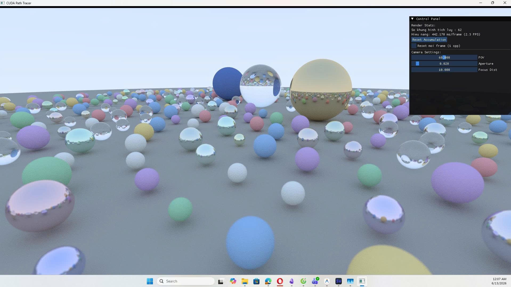
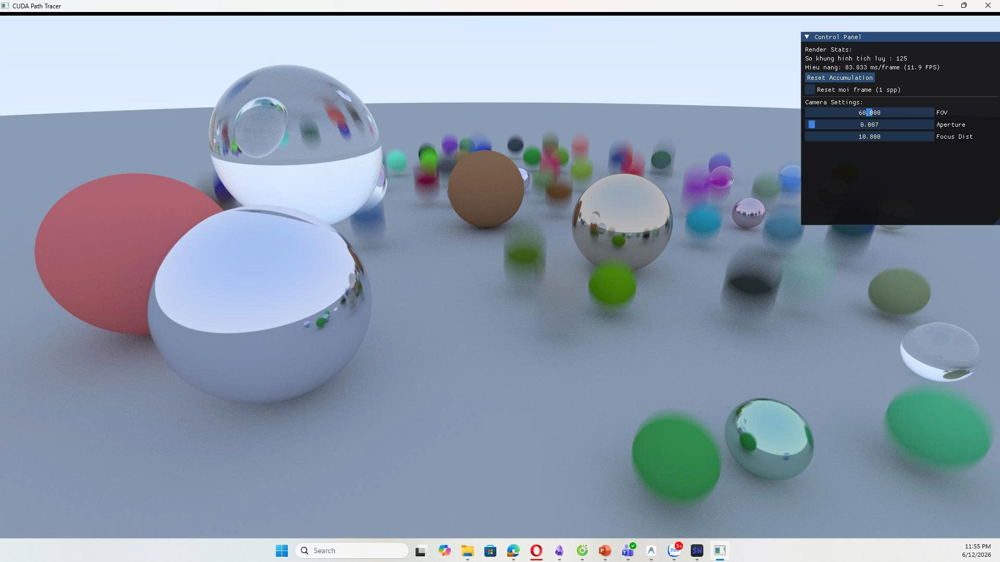
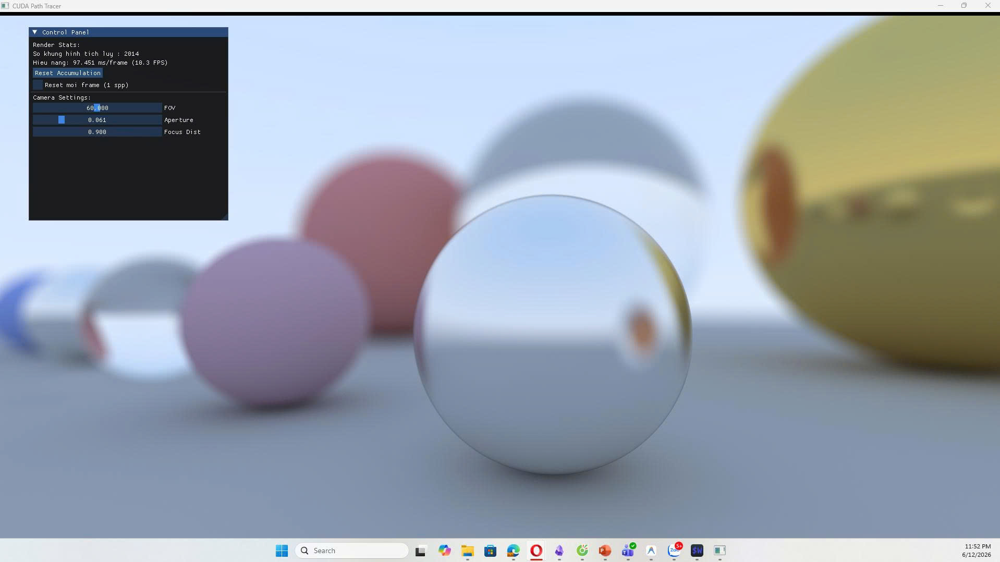

# ScratchPathTracerCUDA

 
> *(TODO: Insert your best showcase render image here. Recommended resolution: 1920x1080)*

A hardware-accelerated Path Tracer written in C++ and CUDA. This project is heavily inspired by the famous *"Ray Tracing in One Weekend"* series, but completely redesigned to run in parallel on CUDA architecture, enabling interactive real-time rendering.

## 🚀 Features & Implementation Progress

Below is the roadmap and development progress of the project:

- [x] **Basic Ray Tracing on CUDA**
- [x] **Anti-Aliasing (AA) & Temporal Accumulation (TA)**
- [x] **Ray-Object Intersection**
- [x] **Material System**
  - Supports Lambertian (Diffuse), Metal (Specular), and Dielectric (Glass/Refraction).
- [x] **Physical Camera**
  - Simulated physical lens (Pinhole -> Lens) with Depth of Field (Aperture) effects.
  - Interactive UI controls via mouse and keyboard.
- [x] **Camera Upgrades**
  - Ray timing simulation for physically accurate **Motion Blur**.
- [x] **Basic Geometric Primitives**
  - Support for 1D, 2D, and 3D primitives including Spheres, Quads (Walls), and Boxes.
- [x] **Bounding Volume Hierarchy (BVH)**
  - GPU-accelerated spatial subdivision for fast intersection tests, enabling real-time rendering of scenes with millions of polygons.
- [x] **Mitsuba 3 Scene Loader**
  - Parsing and loading standardized scenes exported from Mitsuba 3.
- [x] **Texture Mapping**
  - Support for Image textures, Checker patterns, and procedural Perlin Noise.
- [x] **Emissive Materials**
  - Turning geometric primitives into Area Lights.
- [x] **Participating Media (Volumes)**
  - Rendering constant density mediums such as fog, smoke, and clouds.
- [ ] **Advanced Monte Carlo Integration**
  - *In Progress:* Integrating Importance Sampling, complex Probability Density Functions (PDF), and Next Event Estimation (Direct Light Sampling) for rapid noise reduction in complex scenes.

## 🛠 System Requirements

- **OS:** Windows / Linux
- **GPU:** NVIDIA GPU (CUDA compatible)
- **Tools:**
  - [CUDA Toolkit](https://developer.nvidia.com/cuda-toolkit) (Version >= 11.0)
  - CMake (Version >= 3.18)
  - C++ Compiler (MSVC on Windows, GCC/Clang on Linux)

## ⚙️ Build Instructions

1. **Clone the repository:**
   ```bash
   git clone https://github.com/your-username/ScratchPathTracerCUDA.git
   cd ScratchPathTracerCUDA
   ```

2. **Configure with CMake:**
   ```bash
   cmake -B build
   ```

3. **Build the project:**
   ```bash
   cmake --build build --config Release
   ```

4. **Run:**
   Navigate to the `build/Release` (or `build/Debug`) directory and execute `ScratchPathTracerCUDA.exe`.

## 🎮 Interactive Controls
- **Left Mouse Drag:** Orbit Camera.
- **Right Mouse Drag:** Pan Camera.
- **Mouse Wheel:** Zoom In / Zoom Out.
- **ImGui Control Panel:** 
  - Adjust `FOV` (Field of View).
  - Adjust `Aperture` (Depth of Field intensity).
  - Adjust `Focus Dist` (Focal distance).
  - Monitor Performance (FPS, render time per frame).

## 📸 Gallery

*(TODO: Place your rendered images in the `docs/images/` folder and replace the links below)*

| Feature | Image |
|---------|-------|
| **Motion Blur** |  <br> *TODO: Insert an image showing moving spheres with motion blur.* |
| **Depth of Field** |  <br> *TODO: Insert an image showcasing camera focus and bokeh.* |
| **BVH & High Poly** |  <br> *TODO: Insert an image rendering a complex scene like the Stanford Bunny or Cornell Box.* |
| **Textures & Volumes** |  <br> *TODO: Insert an image demonstrating image textures, Perlin noise, or volumetric fog.* |

---
*This project was built for educational and research purposes in Computer Graphics & Parallel Processing.*
